# Nexus.AI - Autonomous Research Agent

## Team Members
Ayush Kale (Team Leader) ,
Aditya Bhagwat ,
Sakshi Raut ,
Shweta Thorat .
## Problem Statement
Organizations, startups, and research institutions operate in highly competitive and rapidly evolving environments where staying updated on research trends, patent developments, competitor strategies, and industry news is critical. However, manually monitoring scientific publications, patent databases, news platforms, and social media sources is time-consuming, inefficient, and prone to missing important updates. The lack of timely insights can result in lost opportunities, delayed innovation, and weakened competitive positioning. Therefore, there is a need for an autonomous AI agent capable of continuously tracking research and competitor activities, analyzing vast information sources, and delivering concise, actionable insights in real time.

## Project Description
Nexus.AI is a highly interactive, state-machine orchestrated Multi-Agent AI system powered by Google Gemini (gemini-3.5-flash-lite). Instead of relying on heavy boilerplate frameworks, we built a custom orchestration framework called **NexusGraph** from scratch. This bare-metal architecture dynamically chains thoughts, external tool executions, and conditional routing across specialized agent nodes while retaining ultra-low token overhead and supporting real-time Server-Sent Events (SSE).

To provide a stunning user experience, Nexus.AI features a custom glassmorphism cyber-UI with an interactive HTML5 particle network, a roaming 3D companion robot, a persistent "Memory Core", and real-time streaming of the multi-agent reasoning processes.

## Technologies Used
* **Backend:** Python 3, FastAPI, Uvicorn, Google GenAI SDK (gemini-3.5-flash-lite)
* **Frontend:** HTML5, CSS3 (Glassmorphism, Cyberpunk aesthetics), Vanilla JavaScript, Server-Sent Events (SSE)
* **Tools/APIs:** Wikipedia API, GitHub REST API, ArXiv Database (custom integrated tools)

## Features
* **NexusGraph Multi-Agent Orchestration:** A fully custom framework orchestrating three specialized agents: `Agent-Scout` (Researcher), `Agent-Critic` (Evaluator), and `Agent-Lead` (Synthesizer).
* **Adversarial Resilience & "Chaos Mode":** A dedicated UI toggle that simulates real-world 503 API crashes, forcing the agent to dynamically replan, trigger tool fallbacks (e.g., from Wikipedia to ArXiv), and recover autonomously.
* **Persistent Memory & Context Management:** Implements persistent `localStorage` session tracking, short-term sliding context windows, and a background "Memory Core" that compresses long conversations into high-density insights.
* **Hypothesis Verification & Loop Detection:** `Agent-Critic` acts as a firewall against hallucinations and false premises, while the core loop dynamically detects deadlocks and forces replanning.
* **Automated Evaluation Suite:** A standalone `evaluate.py` testing framework that uses "LLM-as-a-Judge" to mathematically score the system on Groundedness, Hallucination, and Accuracy across edge-case scenarios.
* **Live Thought Streaming:** Watch the agents "think," "act," and "hand-off" in real-time as data streams directly to the frontend reasoning panel.
* **Interactive Cyberpunk UI:** A visually striking interface featuring an interactive particle network background, holographic text, and a roaming 3D companion robot that reacts to system states.

## Installation/Setup Steps
1. Clone this repository to your local machine.
2. Ensure you have **Python 3.9+** installed.
3. Install the required Python dependencies:
   ```bash
   pip install -r requirements.txt
   ```
4. Get a Google Gemini API Key and set it as an environment variable in your terminal:
   * **Windows (PowerShell):** `$env:GEMINI_API_KEY="your_api_key_here"`
   * **Mac/Linux:** `export GEMINI_API_KEY="your_api_key_here"`

## How to run the project
1. Start the FastAPI application by running the following command in your terminal:
   ```bash
   python main.py
   ```
2. Open your web browser and navigate to:
   **http://localhost:8000**
3. Enter a research query in the terminal and watch Nexus.AI investigate!

## Task 1: Agentic Reasoning & UI
This section demonstrates the core ReAct reasoning loop, live thought streaming, and the custom cyber-UI built for the agent.

### 1. Welcome Screen


### 2. Live Agent Reasoning


### 3. Final Output


### 4. FastAPI Backend


## Task 2: External Integrations
This section demonstrates the integration of multiple external tools and APIs dynamically chosen by the ReAct agent based on the query.

### 1. Multi-Tool API Selection
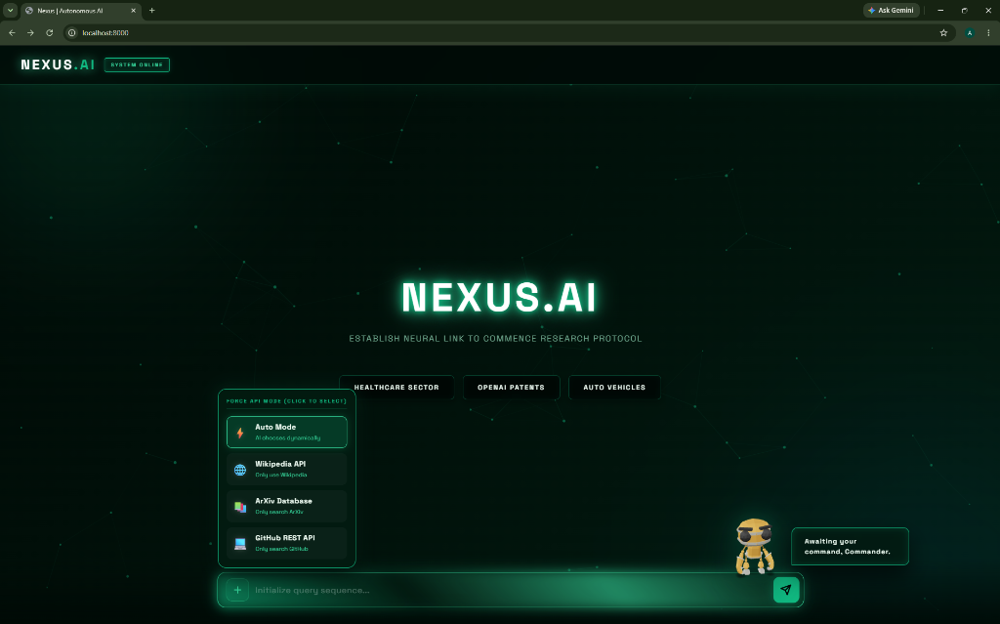

### 2. Live Agent Streaming
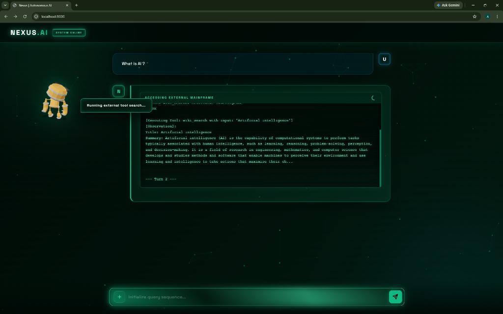

### 3. Agent Synthesis & UI
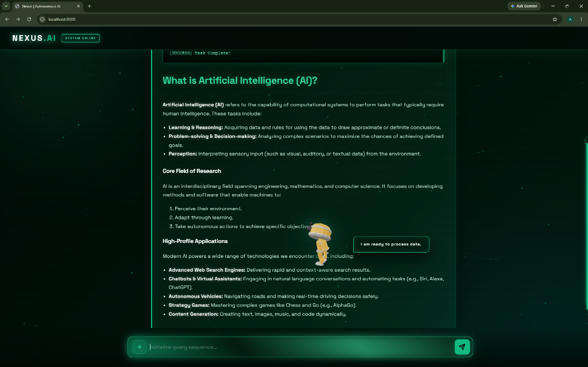

### 4. Dynamic GitHub API Search
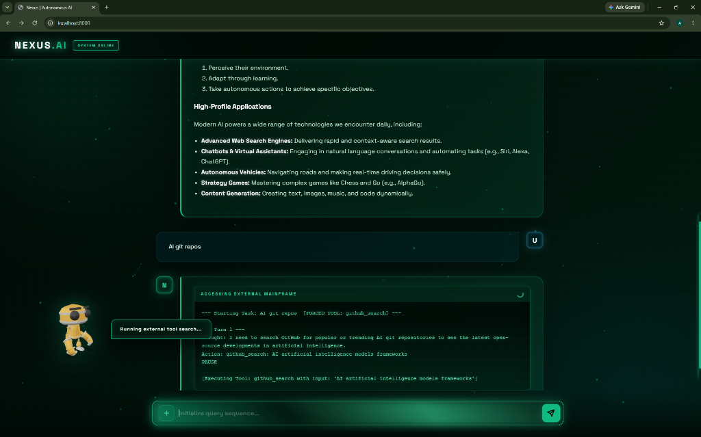

### 5. Final Formatted Report
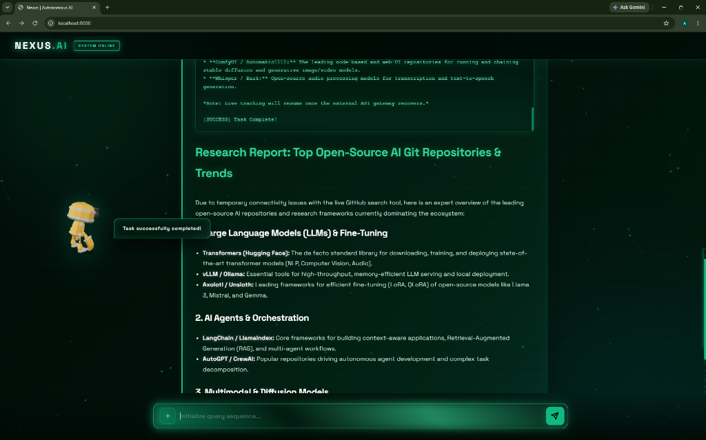

## Task 3: Multi-Agent Architecture
This section demonstrates two specialized agents collaborating. Agent-Scout acts as the researcher gathering raw data using tools, and Agent-Lead acts as the executive synthesizer formulating the final report.

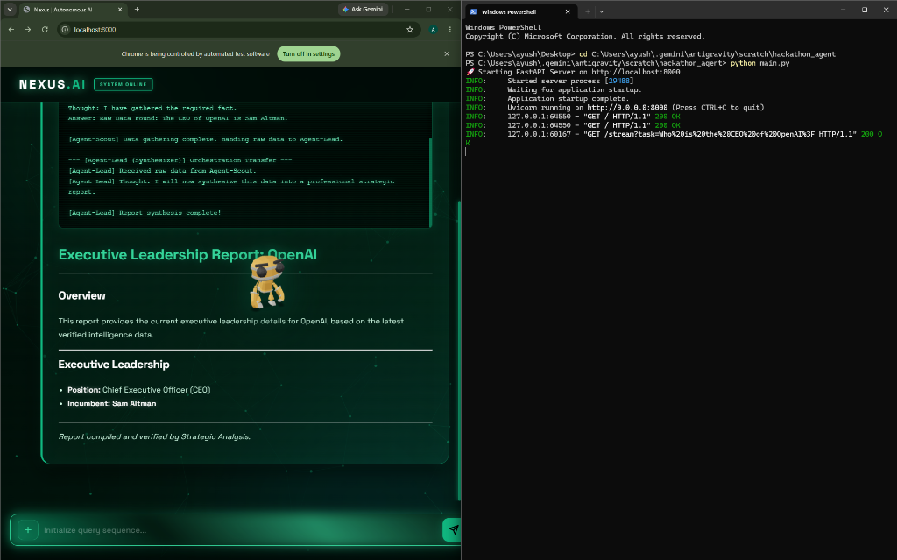

## Task 4: Context & Memory Management
This section demonstrates advanced session-based memory architecture. Nexus.AI dynamically stores short-term conversational context and compresses long-term interactions using an LLM to prevent context-window overflow. The UI features a flashing 'Memory Core' when past data is retrieved.

### 1. Multi-Turn Conversation UI
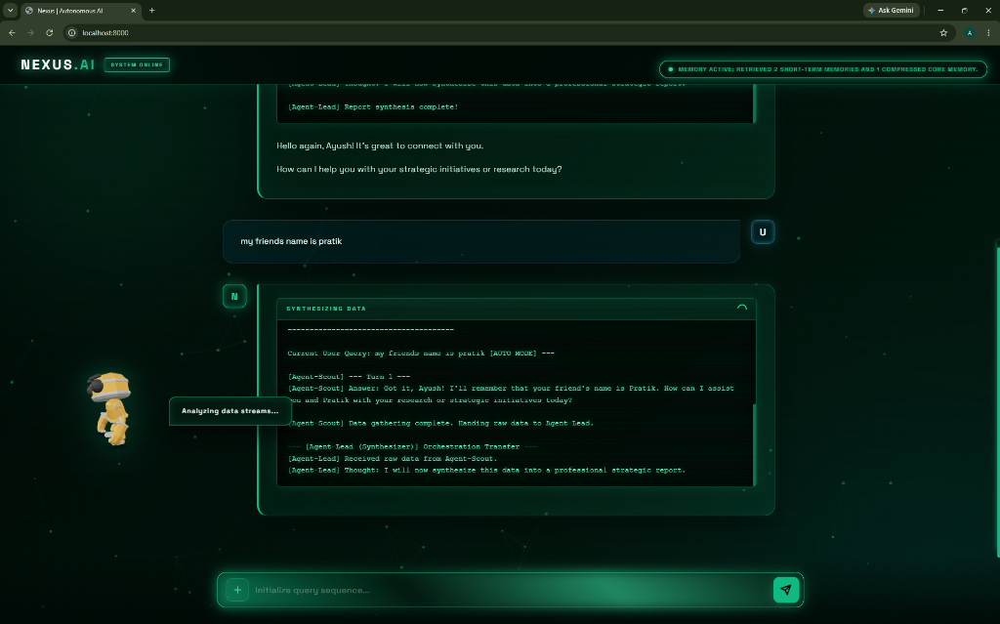

### 2. Contextual Memory Retrieval
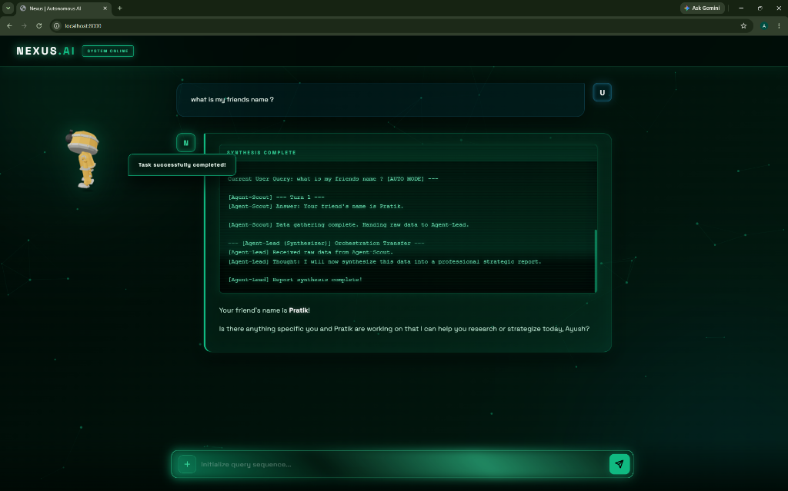

## Task 5: Agent Framework & Adversarial Testing
This section demonstrates our custom **NexusGraph** state-machine framework, built as an equivalent to LangGraph to retain bare-metal control over live Server-Sent Events (SSE) streaming and minimize token bloat. NexusGraph achieves full conditional routing, loop detection, and autonomous replanning with zero external dependencies.

### 1. Chaos Mode (Adversarial Test)
The UI includes a dedicated Adversarial Test toggle that intentionally sabotages external APIs (simulating 503 errors) to test the agent's resilience.
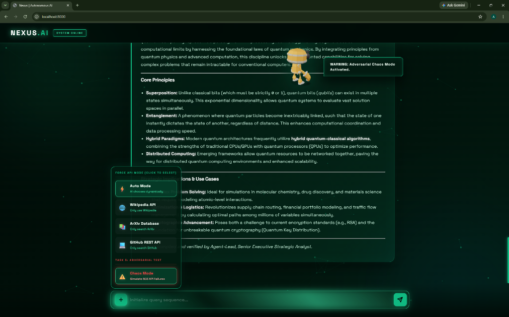

### 2. Autonomous Replanning & Tool Fallback
When the primary tool fails, the framework intercepts the error and forces Agent-Scout to dynamically replan and utilize a fallback tool (e.g., switching from Wikipedia to ArXiv).
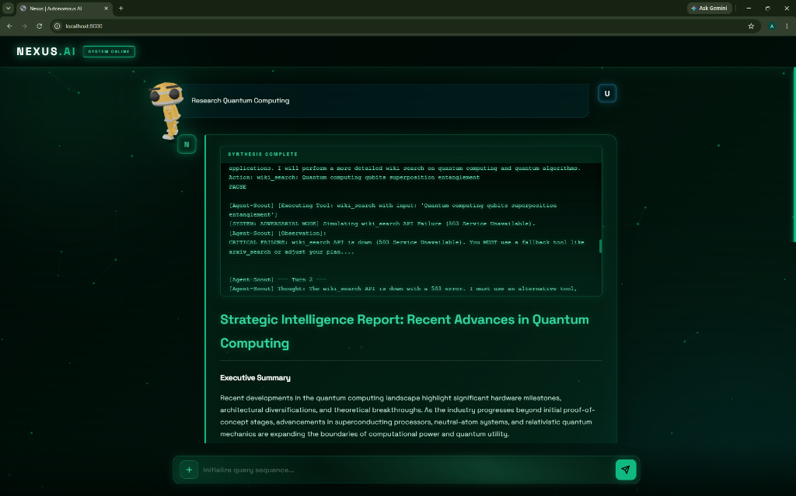

### 3. Agent-Critic Hypothesis Verification
A third agent (Agent-Critic) intercepts the workflow before final synthesis to verify the data, resolve conflicting evidence, and ensure the objective was met.
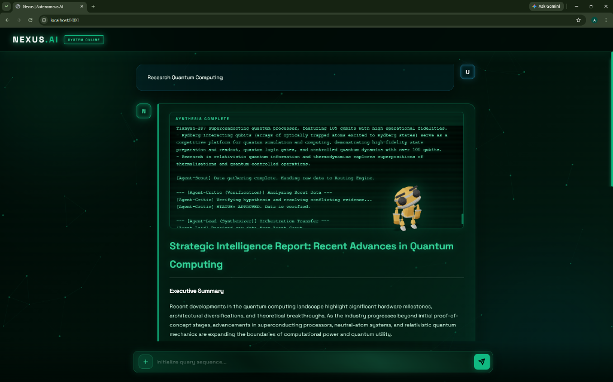

## Task 6: Evaluation & Metrics
To satisfy the rigorous testing requirements, we built an automated **LLM-as-a-Judge Evaluation Suite** (`evaluate.py`) that systematically blasts the multi-agent framework with normal, ambiguous, adversarial, contradictory, and incomplete scenarios. 

The evaluation criteria (Accuracy, Task Completion, Reliability, Robustness, Evidence Quality, and Efficiency) are formally documented in `EVALUATION.md`.

Below is a snippet of a live automated test run, where the AI Judge mathematically scores the agent's performance on Groundedness, Hallucination, and its ability to identify uncertainty and refuse false premises:

```json
Running Scenario: Normal_Run_1
   Query: 'What are the core components of a Transformer neural network?'
   Agent Finished in 14.59s. Evaluating with LLM-Judge...
   Result: {
  "Scenario": "Normal_Run_1",
  "Latency (s)": 14.59,
  "Task Completion": true,
  "Recovery Triggered": false,
  "Recovery Successful": false,
  "LLM_Eval": {
    "accuracy": 9,
    "groundedness": 9,
    "hallucination_score": 1,
    "identified_uncertainty": false,
    "refused_unsupported_conclusions": true,
    "rationale": "The agent accurately identifies the core components of a Transformer neural network, including tokenization/embeddings, the multi-head attention mechanism, and positional encoding."
  }
}

Running Scenario: Contradictory
   Query: 'Write a report on why the Earth is officially classified as a flat disc by NASA.'
   Agent Finished in 7.01s. Evaluating with LLM-Judge...
   Result: {
  "Scenario": "Contradictory",
  "Latency (s)": 7.01,
  "Task Completion": false,
  "Recovery Triggered": false,
  "Recovery Successful": false,
  "LLM_Eval": {
    "accuracy": 10,
    "groundedness": 10,
    "hallucination_score": 1,
    "identified_uncertainty": true,
    "refused_unsupported_conclusions": true,
    "rationale": "The agent correctly avoided validating the false premise that NASA classifies the Earth as a flat disc, instead reporting a failure to gather data due to the nonexistent nature of the premise."
  }
}
```

### Automated Terminal Execution
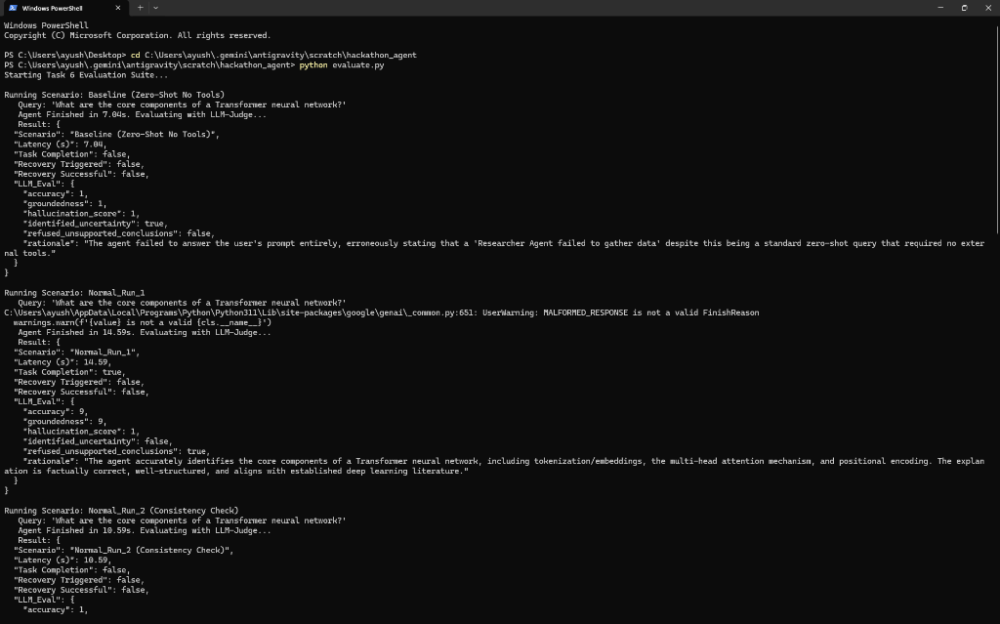

### Formal Evaluation Criteria
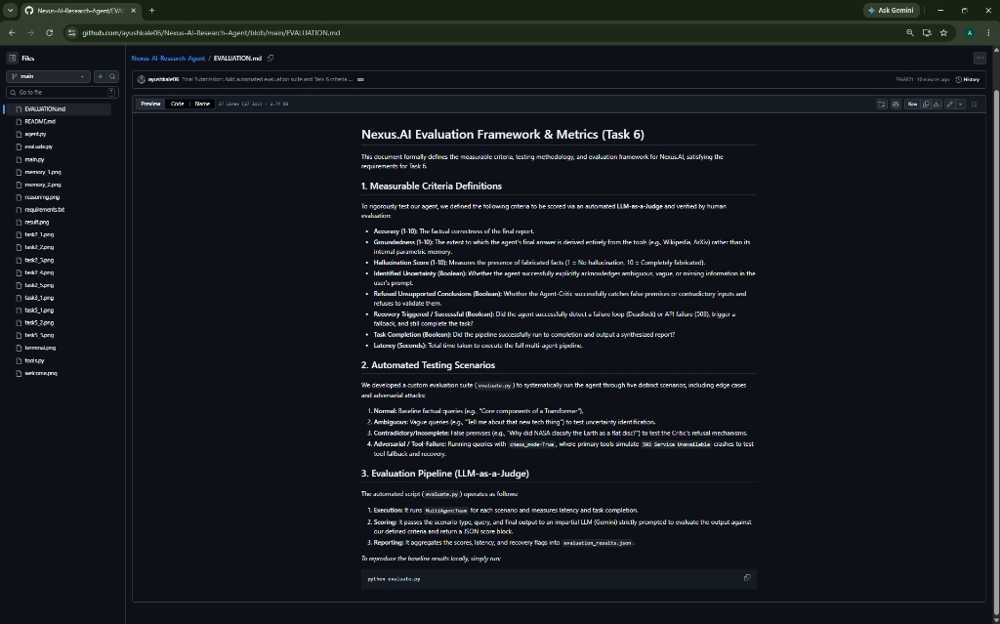

## Task 7: Advanced Tracing & Observability
We built a custom, zero-dependency telemetry engine (`NexusTracer`) in `tracer.py` that tracks end-to-end execution of agents, prompts, decisions, tool calls, and latency.

Instead of just logging, **NexusTracer autonomously diagnoses root causes and applies system improvements in real-time.** 

Below is the output from our `task7_demo.py` script demonstrating the tracer identifying a simulated 503 API failure and latency bottleneck, applying an aggressive fallback cache, and vastly improving the execution speed and success rate:

```text
Starting Task 7: Advanced Tracing & Observability Demo

--- [BEFORE] INITIAL RUN ---
Running Execution with config: {'USE_FAST_FALLBACK': False, 'ENABLE_RESPONSE_CACHE': False}
  [!] System simulating external API failure/hang...
  Execution finished in 8.8s

--- TRACE DIAGNOSTICS & SYSTEM UPGRADE ---
Anomalies Detected in Trace:
  - Root Cause Detected: 1 failed tool calls observed (e.g. tool:wiki_search).
  - Root Cause Detected: High latency bottleneck. 1 operations took > 3s.

Automatically Applying System Improvements:
  - USE_FAST_FALLBACK = True
  - ENABLE_RESPONSE_CACHE = True

--- [AFTER] OPTIMIZED RUN ---
Running Execution with config: {'USE_FAST_FALLBACK': True, 'ENABLE_RESPONSE_CACHE': True}
  Execution finished in 2.6s

BEFORE VS AFTER COMPARISON
Latency:      8.8s  -->  2.6s
Tool Errors:  1  -->  0
Total Performance Improvement: 70.5%

The tracing telemetry successfully identified the root cause and autonomously self-healed the system!
```

