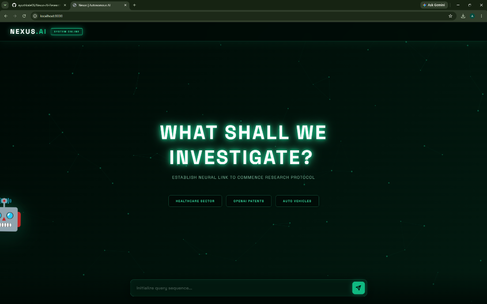
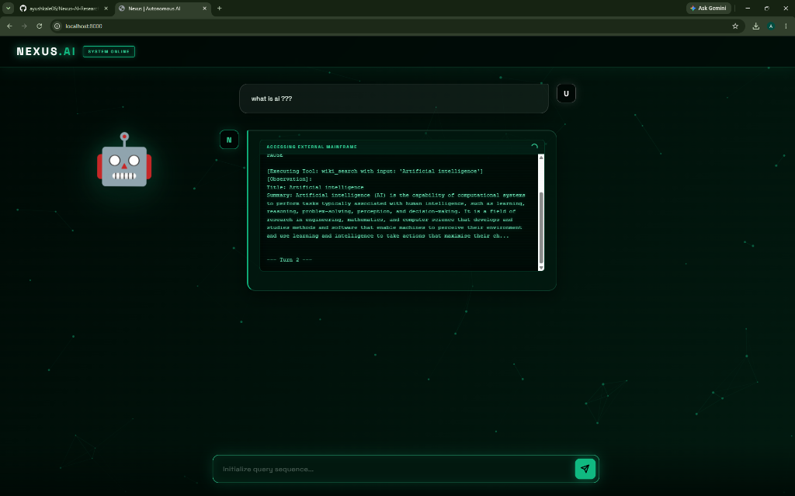
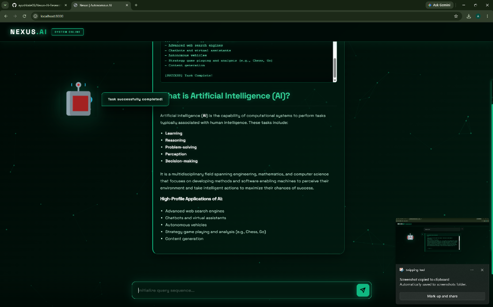
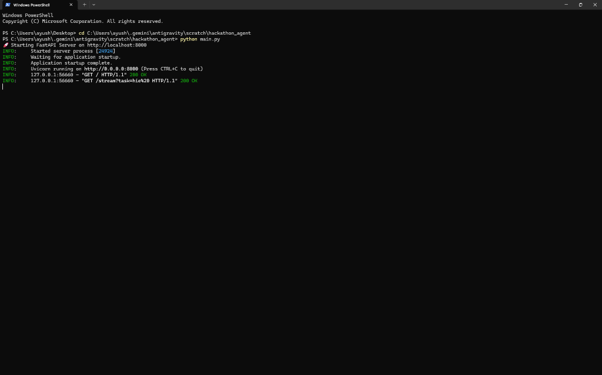

# Nexus.AI - Autonomous Research Agent

## Team Members
Ayush Kale (Team Leader)
Aditya Bhagwat
Sakshi Raut
Shweta Thorat
## Problem Statement
Organizations, startups, and research institutions operate in highly competitive and rapidly evolving environments where staying updated on research trends, patent developments, competitor strategies, and industry news is critical. However, manually monitoring scientific publications, patent databases, news platforms, and social media sources is time-consuming, inefficient, and prone to missing important updates. The lack of timely insights can result in lost opportunities, delayed innovation, and weakened competitive positioning. Therefore, there is a need for an autonomous AI agent capable of continuously tracking research and competitor activities, analyzing vast information sources, and delivering concise, actionable insights in real time.

## Project Description
Nexus.AI is a highly interactive, autonomous ReAct (Reasoning and Acting) agent powered by Google Gemini. Instead of relying on heavy boilerplate frameworks, we built a pure Python reasoning loop from scratch that dynamically chains thoughts, tool executions, and observations. 

To provide a stunning user experience, Nexus.AI features a custom glassmorphism cyber-UI with an interactive HTML5 particle network, a roaming 3D companion robot, and real-time streaming of the agent's internal thought processes via Server-Sent Events (SSE).

## Technologies Used
* **Backend:** Python 3, FastAPI, Uvicorn, Google GenAI SDK (Gemini)
* **Frontend:** HTML5 (Canvas), CSS3 (Glassmorphism, Cyberpunk aesthetics), Vanilla JavaScript, Server-Sent Events (SSE)
* **Tools/APIs:** Wikipedia API (external data fetching)

## Features
* **Custom ReAct Agent:** A pure Python implementation of the ReAct prompting framework built entirely from scratch.
* **Live Thought Streaming:** Watch the agent "think" and "act" in real-time as data streams directly to the frontend reasoning panel.
* **Interactive Cyberpunk UI:** A visually striking interface featuring an interactive particle network background and holographic text.
* **Roaming 3D Companion:** An animated 3D robot that flies around the screen and reacts to the agent's processing states.
* **Tool Integration:** Dynamically fetches and processes live data from Wikipedia.
* **Resilience:** Built-in rate-limit handling with exponential backoff to ensure reliable API interactions.

## Installation/Setup Steps
1. Clone this repository to your local machine.
2. Ensure you have **Python 3.9+** installed.
3. Install the required Python dependencies:
   ```bash
   pip install -r requirements.txt
   ```
4. Get a Google Gemini API Key and set it as an environment variable in your terminal:
   * **Windows (PowerShell):** `$env:GEMINI_API_KEY="your_api_key_here"`
   * **Mac/Linux:** `export GEMINI_API_KEY="your_api_key_here"`

## How to run the project
1. Start the FastAPI application by running the following command in your terminal:
   ```bash
   python main.py
   ```
2. Open your web browser and navigate to:
   **http://localhost:8000**
3. Enter a research query in the terminal and watch Nexus.AI investigate!

## Screenshots / Demo
### 1. Welcome Screen


### 2. Live Agent Reasoning


### 3. Final Output


### 4. FastAPI Backend

